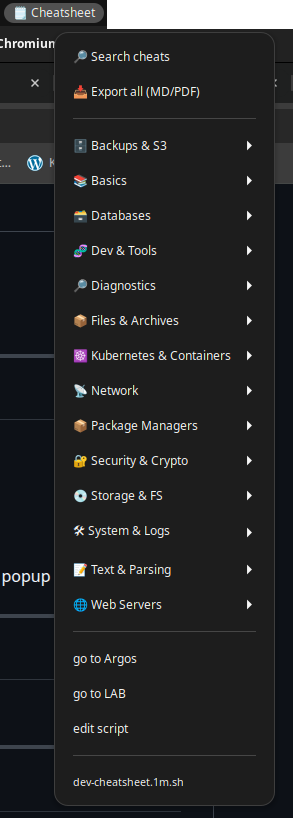
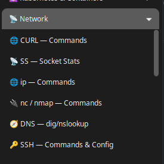
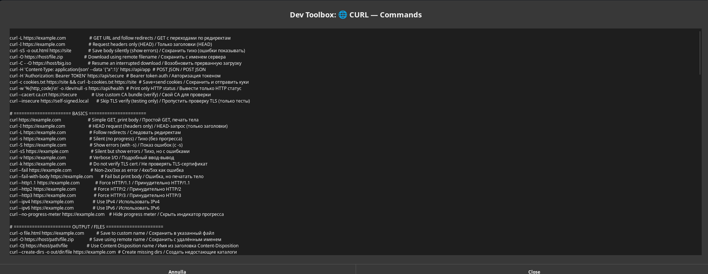

# 📒 DevToolbox Cheats — Universal Linux Cheatsheet Manager

**Cross-Desktop cheatsheet manager** for Linux with native support for GNOME, KDE, XFCE, and more. Access your Markdown command references instantly from your panel or menu.


---
## Overview
> [!IMPORTANT]
> **Batteries Included!** This repository is not just a menu engine; it comes pre-packed with a comprehensive collection of over **100+ production-ready cheatsheets** for sysadmins, DevOps, and developers.

---


If you like this project, consider supporting me on [Buy Me a Coffee](https://www.buymeacoffee.com/dominatos) ☕️

---

## Example Screenshots
<details>
<summary>Screenshots from GNOME ARGOS</summary>



</details>
<details>
<summary>Screenshots from KDE Plasma 5/6</summary>


</details>
<details>
<summary>Screenshots from universal Zenity (XFCE, MATE, Cinnamon, LXQt, LXDE, Budgie, Pantheon, Deepin)</summary>


</details>


## ✨ Features

### 🌍 Universal Desktop Support
- **GNOME** - Native Argos panel menu with dropdown
- **KDE Plasma 5/6** - Native widget with full UI
- **XFCE / MATE / Cinnamon** - Dialog-based menus (zenity/yad)
- **LXQt / LXDE** - Lightweight dialog menus
- **Budgie / Pantheon / Deepin** - Dialog-based menus with auto-detection
- **Tiling WMs** - Terminal-based with FZF (i3, sway, bspwm, hyprland)
- **Auto-Detection** - Detects your DE and adapts automatically

### 🚀 Performance
- **Instant Loading** - Smart caching loads 100+ cheats in <100ms
- **Fast Category Toggle** - Optimized for instant expand/collapse (KDE widget)
- **Auto Cache Invalidation** - Rebuilds only when files change

### 🎯 Core Features
- **Category Organization** - Group cheats by topic with emoji icons
- **Live Search** - Filter cheats as you type
- **Copy to Clipboard** - One-click copy (wl-clipboard/xclip)
- **Open in Editor** - Launch any editor (auto-detected or custom)
- **Export** - Save individual or all cheats to Markdown/PDF
- **FZF Integration** - Powerful fuzzy search in terminal with syntax highlighting

### 🎨 Smart Features (KDE Widget)
- **Editor Auto-Detection** - Scans for 16+ popular editors
- **Editor Dropdown** - Quick selection with ✓ marks for installed
- **Auto-Fallback** - Uses first available editor if preferred missing
- **Custom Icons** - Emoji or system icons per category/cheat
- **Safe Install** - No crashes, works in VMs

---

## 📦 Installation

### Choose Your Desktop Environment

<details>
<summary><b>🟠 GNOME (Argos Extension)</b></summary>

#### 1. Install Argos Extension
From [extensions.gnome.org](https://extensions.gnome.org/extension/1176/argos/) or [GitHub](https://github.com/p-e-w/argos)

#### 2. Install Dependencies
```bash
# Debian/Ubuntu
sudo apt install zenity xclip fzf bat pandoc

# Fedora
sudo dnf install zenity xclip fzf bat pandoc

# Arch
sudo pacman -S zenity xclip fzf bat pandoc
```

#### 3. Clone and Link
```bash
git clone https://github.com/dominatos/devtoolbox-cheats.git
cd devtoolbox-cheats
chmod +x devtoolbox-cheats.30s.sh
mv devtoolbox-cheats.30s.sh ~/.config/argos/
mv cheats.d/ ~/cheats.d/

```

#### 4. Restart Argos
Disable and re-enable the Argos extension, or press `Alt+F2` → `r` → `Enter`

**Result:** 🗒️ icon appears in your top panel with dropdown menu

</details>

<details>
<summary><b>🔵 KDE Plasma 5/6 (Native Widget)</b></summary>

#### Quick Install

```bash
# Clone repository
git clone https://github.com/dominatos/devtoolbox-cheats.git
cd devtoolbox-cheats

# Install for Plasma 6 (recommended)
cd kde-widget-plasma6
./install.sh

# OR Install for Plasma 5
cd kde-widget-plasma5
./install.sh
```

The installer will:
1. ✅ Install widget to `~/.local/share/plasma/plasmoids/`
2. ✅ Clear QML cache (ensures config shows correctly)
3. ✅ Deploy 133 example cheatsheets to `~/cheats.d`
4. ✅ Install dependencies (fzf, bat, wl-clipboard, fonts)
5. ✅ Prompt for safe Plasma Shell restart

#### After Install

1. **Add to Panel:**
   - Right-click panel → Add Widgets
   - Search "DevToolbox Cheats"
   - Drag to panel or desktop

2. **Configure:**
   - Right-click widget → Configure
   - **Editor Dropdown** - Select from auto-detected editors (marked with ✓)
   - **Cheats Directory** - Default: `~/cheats.d`
   - **Cache File** - Default: `~/.cache/devtoolbox-cheats.json`

3. **Usage:**
   - Click widget to open
   - Click categories to expand
   - Click cheat to open in editor
   - Use buttons: Copy, Open, Export, FZF Search

</details>

<details>
<summary><b>🟢 XFCE / MATE / Cinnamon</b></summary>

#### 1. Install Dependencies
```bash
# Debian/Ubuntu
sudo apt install zenity xclip fzf bat pandoc

# Fedora
sudo dnf install zenity xclip fzf bat pandoc

# For Wayland sessions, use wl-clipboard instead of xclip
```

#### 2. Clone Repository
```bash
git clone https://github.com/dominatos/devtoolbox-cheats.git
cd devtoolbox-cheats
```

#### 3. Run Manually or Add to Panel

**Run manually:**
```bash
./devtoolbox-cheats.30s.sh menu
```

**Add to panel (XFCE):**
1. Install Genmon plugin: `sudo apt install xfce4-genmon-plugin`
2. Right-click panel → Add New Items → "Generic Monitor"
3. Right-click the new monitor → Properties:
   - **Label:** 🗒️ (or leave blank)
   - **Command:** `~/devtoolbox-cheats/devtoolbox-cheats.30s.sh menu`
   - **Period (s):** 30

**Add to panel (MATE):**
1. Right-click panel → "Add to Panel..."
2. Select "Custom Application Launcher" → Add
3. Configure properties:
   - **Type:** Application
   - **Name:** DevToolbox Cheats
   - **Command:** `~/devtoolbox-cheats/devtoolbox-cheats.30s.sh menu`
   - **Icon:** 🗒️ (click to select icon)

**Add to panel (Cinnamon):**
1. Right-click the Menu applet → Configure → Menu → "Open the menu editor"
2. Select a category (e.g., Accessories) → "New Item"
3. Configure properties:
   - **Name:** DevToolbox Cheats
   - **Command:** `bash -c '~/devtoolbox-cheats/devtoolbox-cheats.30s.sh menu'`
   - **Icon:** 🗒️ (click to select icon)
4. Save and close the menu editor.
5. Open the Cinnamon Menu, search for "DevToolbox Cheats", right-click it, and select "Add to panel".

</details>

<details>
<summary><b>🟣 LXQt / LXDE (Lightweight)</b></summary>

#### 1. Install Dependencies
```bash
# Debian/Ubuntu (LXQt)
sudo apt install zenity xclip fzf bat pandoc

# Lubuntu (LXQt)
sudo apt install zenity xclip fzf bat pandoc

# LXDE
sudo apt install zenity xclip fzf bat pandoc

# Arch
sudo pacman -S zenity xclip fzf bat pandoc
```

#### 2. Clone Repository
```bash
git clone https://github.com/dominatos/devtoolbox-cheats.git
cd devtoolbox-cheats
```

#### 3. Add to Panel

**LXQt Panel:**
1. Right-click panel → "Manage Widgets" → "Add Widgets"
2. Select "Custom command" → Add
3. Right-click the Custom command widget → Configure
4. Click "+" to add new launcher:
   - **Name:** DevToolbox Cheats
   - **Command:** `bash -c '~/devtoolbox-cheats/devtoolbox-cheats.30s.sh menu'`
   - **Click command:** `bash -c '~/devtoolbox-cheats/devtoolbox-cheats.30s.sh menu'`
   - **Icon:** Click to browse and select a suitable icon (e.g., accessories-text-editor)
5. Click OK and close

**LXDE Panel (PCManFM):**
1. Right-click panel → "Add / Remove Panel Items"
2. Select "Application Launch Bar" → Add
3. Click "Application Launch Bar" → Preferences
4. Click "+" to add application:
   - Browse to create desktop file or add command:
   - **Command:** `bash -c '~/devtoolbox-cheats/devtoolbox-cheats.30s.sh menu'`
5. Close preferences

**Or use desktop shortcut:**
```bash
cat > ~/Desktop/DevToolbox-Cheats.desktop <<EOF
[Desktop Entry]
Version=1.0
Type=Application
Name=DevToolbox Cheats
Comment=Quick access to command cheatsheets
Exec=bash -c '~/devtoolbox-cheats/devtoolbox-cheats.30s.sh menu'
Icon=accessories-text-editor
Terminal=false
Categories=Utility;
EOF
chmod +x ~/Desktop/DevToolbox-Cheats.desktop
```

**Result:** Clicking launches dialog menu with all cheats

</details>

<details>
<summary><b>🟡 Budgie Desktop</b></summary>

#### 1. Install Dependencies
```bash
# Ubuntu Budgie / Solus
sudo apt install zenity xclip fzf bat pandoc

# Arch (with Budgie)
sudo pacman -S zenity xclip fzf bat pandoc
```

#### 2. Clone Repository
```bash
git clone https://github.com/dominatos/devtoolbox-cheats.git
cd devtoolbox-cheats
```

#### 3. Add to Panel

**Using Budgie Menu:**
1. Open Budgie Menu → Right-click → "Edit Applications"
2. Navigate to "Accessories" or "Development" category
3. Click "New Item":
   - **Name:** DevToolbox Cheats
   - **Command:** `bash -c '~/devtoolbox-cheats/devtoolbox-cheats.30s.sh menu'`
   - **Icon:** Click to select (e.g., accessories-text-editor)
4. Save and close

**Using Quick Launch:**
1. Right-click Budgie panel → "Add Applets"
2. Find "QuickNote" or use "Icon Task List"
3. Or create desktop launcher:

```bash
mkdir -p ~/.local/share/applications
cat > ~/.local/share/applications/devtoolbox-cheats.desktop <<EOF
[Desktop Entry]
Version=1.0
Type=Application
Name=DevToolbox Cheats
Comment=Quick access to command cheatsheets
Exec=bash -c '~/devtoolbox-cheats/devtoolbox-cheats.30s.sh menu'
Icon=accessories-text-editor
Terminal=false
Categories=Utility;Development;
EOF
chmod +x ~/.local/share/applications/devtoolbox-cheats.desktop
```

4. Open Budgie Menu, search "DevToolbox", drag to Favorites or panel

**Or use Plank (dock):**
```bash
# Right-click any icon in Plank dock → Preferences
# Drag the .desktop file from ~/.local/share/applications to the dock
```

**Result:** Clicking launches dialog menu with zenity interface

</details>

<details>
<summary><b>🔷 Pantheon (elementary OS)</b></summary>

#### 1. Install Dependencies
```bash
# elementary OS
sudo apt install zenity xclip fzf bat pandoc
```

#### 2. Clone Repository
```bash
git clone https://github.com/dominatos/devtoolbox-cheats.git
cd devtoolbox-cheats
```

#### 3. Add to Applications Menu

**Create application launcher:**
```bash
mkdir -p ~/.local/share/applications
cat > ~/.local/share/applications/devtoolbox-cheats.desktop <<EOF
[Desktop Entry]
Version=1.0
Type=Application
Name=DevToolbox Cheats
Comment=Quick access to command cheatsheets
Exec=bash -c '~/devtoolbox-cheats/devtoolbox-cheats.30s.sh menu'
Icon=accessories-text-editor
Terminal=false
Categories=Utility;Development;
Keywords=cheat;cheatsheet;command;reference;
EOF
chmod +x ~/.local/share/applications/devtoolbox-cheats.desktop
```

#### 4. Add to Dock

1. Press `Super` (Windows key) to open Applications
2. Search for "DevToolbox Cheats"
3. Right-click → "Add to Dock"

**Or add to Wingpanel (top panel) using keyboard shortcut:**

1. Open System Settings → Keyboard → Shortcuts → Custom
2. Click "+" to add:
   - **Name:** DevToolbox Cheats
   - **Command:** `bash -c '~/devtoolbox-cheats/devtoolbox-cheats.30s.sh menu'`
   - **Shortcut:** Press keys (e.g., `Super+C`)

**Result:** Elegant zenity dialog matching elementary OS design language

</details>

<details>
<summary><b>🔵 Deepin Desktop</b></summary>

#### 1. Install Dependencies
```bash
# Deepin OS / UbuntuDDE
sudo apt install zenity xclip fzf bat pandoc

# Arch with Deepin
sudo pacman -S zenity xclip fzf bat pandoc
```

#### 2. Clone Repository
```bash
git clone https://github.com/dominatos/devtoolbox-cheats.git
cd devtoolbox-cheats
```

#### 3. Add to Launcher

**Create application entry:**
```bash
mkdir -p ~/.local/share/applications
cat > ~/.local/share/applications/devtoolbox-cheats.desktop <<EOF
[Desktop Entry]
Version=1.0
Type=Application
Name=DevToolbox Cheats
Comment=Quick access to command cheatsheets
Exec=bash -c '~/devtoolbox-cheats/devtoolbox-cheats.30s.sh menu'
Icon=accessories-text-editor
Terminal=false
Categories=Utility;Development;
EOF
chmod +x ~/.local/share/applications/devtoolbox-cheats.desktop
```

#### 4. Add to Dock or Control Center

1. Open Launcher (click grid icon in dock)
2. Find "DevToolbox Cheats" in Applications
3. Right-click → "Send to Desktop" or "Pin to Dock"

**Or use Control Center shortcut:**

1. Open Control Center → Keyboard and Language → Shortcuts → Custom Shortcuts
2. Click "+" to add:
   - **Name:** DevToolbox Cheats  
   - **Command:** `bash -c '~/devtoolbox-cheats/devtoolbox-cheats.30s.sh menu'`
   - **Shortcut:** Click "None" and press keys (e.g., `Ctrl+Alt+C`)

**Result:** Beautiful dialog matching Deepin's aesthetic with blur effects

</details>

<details>
<summary><b>🚀 Cosmic (Pop!_OS - NEW 2025)</b></summary>

#### 1. Install Dependencies
```bash
# Pop!_OS with Cosmic
sudo apt install zenity fzf bat pandoc wl-clipboard

# Cosmic uses Wayland by default
```

#### 2. Clone Repository
```bash
git clone https://github.com/dominatos/devtoolbox-cheats.git
cd devtoolbox-cheats
```

#### 3. Add to Cosmic Launcher

**Create application entry:**
```bash
mkdir -p ~/.local/share/applications
cat > ~/.local/share/applications/devtoolbox-cheats.desktop <<EOF
[Desktop Entry]
Version=1.0
Type=Application
Name=DevToolbox Cheats
Comment=Quick access to command cheatsheets
Exec=bash -c '~/devtoolbox-cheats/devtoolbox-cheats.30s.sh menu'
Icon=accessories-text-editor
Terminal=false
Categories=Utility;Development;
EOF
chmod +x ~/.local/share/applications/devtoolbox-cheats.desktop
```

#### 4. Add Keyboard Shortcut

1. Open Settings → Keyboard → View and Customize Shortcuts → Custom Shortcuts
2. Click "+" to add:
   - **Name:** DevToolbox Cheats
   - **Command:** `bash -c '~/devtoolbox-cheats/devtoolbox-cheats.30s.sh menu'`
   - **Shortcut:** Press keys (e.g., `Super+C`)

**Or add to Cosmic Dock:**

1. Press `Super+/` to open Launcher
2. Type "DevToolbox Cheats"
3. Right-click → "Pin to Dock"

**Result:** Modern Rust-based dialog with native Cosmic integration

</details>

<details>
<summary><b>⚫ Tiling WMs (i3, sway, bspwm, hyprland)</b></summary>

#### 1. Install Dependencies
```bash
# X11 Window Managers (i3, bspwm, awesome)
sudo apt install fzf bat xclip pandoc zenity

# Wayland Compositors (sway, hyprland, river)
sudo apt install fzf bat wl-clipboard pandoc wofi

# Arch (X11)
sudo pacman -S fzf bat xclip pandoc zenity rofi

# Arch (Wayland)
sudo pacman -S fzf bat wl-clipboard pandoc wofi
```

#### 2. Clone Repository
```bash
git clone https://github.com/dominatos/devtoolbox-cheats.git
cd devtoolbox-cheats
```

#### 3. Add Keybinding

**i3 config (`~/.config/i3/config`):**
```bash
bindsym $mod+c exec --no-startup-id ~/devtoolbox-cheats/devtoolbox-cheats.30s.sh menu
```

**sway config (`~/.config/sway/config`):**
```bash
bindsym $mod+c exec ~/devtoolbox-cheats/devtoolbox-cheats.30s.sh menu
```

**bspwm config (`~/.config/sxhkd/sxhkdrc`):**
```bash
super + c
    ~/devtoolbox-cheats/devtoolbox-cheats.30s.sh menu
```

**hyprland config (`~/.config/hypr/hyprland.conf`):**
```bash
bind = SUPER, C, exec, ~/devtoolbox-cheats/devtoolbox-cheats.30s.sh menu
```

**awesome wm config (`~/.config/awesome/rc.lua`):**
```lua
awful.key({ modkey }, "c",
    function () awful.spawn.with_shell("~/devtoolbox-cheats/devtoolbox-cheats.30s.sh menu") end,
    {description = "open devtoolbox cheats", group = "launcher"})
```

**dwm config (`config.h` - requires recompile):**
```c
static const char *cheatcmd[] = { "/bin/sh", "-c", "~/devtoolbox-cheats/devtoolbox-cheats.30s.sh menu", NULL };
{ MODKEY, XK_c, spawn, {.v = cheatcmd } },
```

#### 4. Add to Launcher Menu (Optional)

**rofi (X11):**
```bash
# Add this alias to ~/.bashrc or ~/.zshrc
alias cheats='~/devtoolbox-cheats/devtoolbox-cheats.30s.sh menu'

# Or integrate directly with rofi
bindsym $mod+c exec "rofi -show run -run-command 'bash -c ~/devtoolbox-cheats/devtoolbox-cheats.30s.sh menu'"
```

**wofi (Wayland):**
```bash
# Add to sway/hyprland config
bindsym $mod+c exec ~/devtoolbox-cheats/devtoolbox-cheats.30s.sh menu | wofi --dmenu
```

**Result:** Opens dialog menu (if zenity/rofi installed) or FZF terminal search

</details>

---

## 📋 Requirements

### Core (All Platforms)
- Bash 4.0+
- `find`, `grep`, `sed`, `awk`

### Desktop-Specific

| Desktop | Required | Optional |
|---------|----------|----------|
| **GNOME** | Argos extension | `zenity`, `xclip`, `fzf`, `bat` |
| **KDE Plasma** | `kdialog`, `wl-clipboard` | `fzf`, `bat`, `noto-fonts-emoji` |
| **XFCE/MATE/Cinnamon** | `zenity`, `xclip` | `fzf`, `bat` |
| **LXQt/LXDE** | `zenity`, `xclip` | `fzf`, `bat` |
| **Budgie** | `zenity`, `xclip` | `fzf`, `bat` |
| **Pantheon** | `zenity`, `xclip` | `fzf`, `bat` |
| **Deepin** | `zenity`, `xclip` | `fzf`, `bat` |
| **Cosmic** | `zenity`, `wl-clipboard` | `fzf`, `bat` |
| **Wayland** | `wl-clipboard` | `zenity`, `fzf`, `bat` |
| **X11** | `xclip` | `zenity`, `fzf`, `bat` |
| **Terminal/Tiling WM** | `fzf` | `bat`, `zenity`, `rofi`, `wofi` |

### Supported Editors (Auto-Detected)
- **VS Code** (`code`), **VS Codium** (`codium`)
- **Kate** (`kate`), **KWrite** (`kwrite`)
- **Geany** (`geany`), **Gedit** (`gedit`)
- **Sublime Text** (`subl`), **Atom** (`atom`)
- **Vim** (`vim`), **Neovim** (`nvim`)
- **Emacs** (`emacs`), **Nano** (`nano`)
- **Mousepad** (`mousepad`), **Pluma** (`pluma`)
- **XED** (`xed`), **Notepadqq** (`notepadqq`)
- **Custom** - Any command

---

## 📚 Creating Cheatsheets

### File Structure

Cheatsheets are Markdown files organized in category subfolders under `~/cheats.d/`.

**Directory structure:**
```
~/cheats.d/
├── databases/
│   ├── mysqlcheatsheet.md
│   ├── mongodbcheatsheet.md
│   ├── postgrescheatsheet.md
│   └── redis_prod_cheatsheet.md
├── kubernetes-containers/
│   ├── docker-basics.md
│   ├── docker-compose.md
│   └── kubernetes-commands.md
├── network/
│   ├── nginx-config.md
│   ├── ssh-tunneling.md
│   └── firewall-basics.md
└── security-crypto/
    ├── ssl-certificates.md
    ├── gpg-basics.md
    └── openssl-commands.md
```

**Each Markdown file contains metadata in the first 80 lines:**

```markdown
Title: MySQL Queries
Group: Databases
Icon: 🗄️
Order: 1

# MySQL Commands

## Basic Queries

```bash
# Show databases
mysql -u root -p -e "SHOW DATABASES;"

# Create database
mysql -u root -p -e "CREATE DATABASE mydb;"
```

## User Management

```bash
# Create user
CREATE USER 'newuser'@'localhost' IDENTIFIED BY 'password';

# Grant privileges
GRANT ALL PRIVILEGES ON mydb.* TO 'newuser'@'localhost';
```
```

### Metadata Fields

- **Title:** (Required) Display name for the cheat
- **Group:** (Required) Category name (matches subfolder or custom)
- **Icon:** (Optional) Emoji (🐳) or system icon name (`docker`)
- **Order:** (Optional) Sort order within group (1-999)

### Icon Options

**Emoji:**
```markdown
Icon: 🐳
Icon: 🔒
Icon: 🌐
```

**System Icons:**
```markdown
Icon: docker
Icon: database-server
Icon: network-server
```

### Result in Menu

**Categories are auto-detected from subfolders:**
- **🗄️ Databases** → MySQL Queries, MongoDB Basics, PostgreSQL, Redis
- **🐳 Kubernetes & Containers** → Docker Basics, Docker Compose, Kubernetes Commands
- **🌐 Network** → Nginx Config, SSH Tunneling, Firewall Basics
- **🔒 Security & Crypto** → SSL Certificates, GPG Basics, OpenSSL Commands

---

## 🎯 Usage

### GNOME (Argos)

1. **Click 🗒️ icon** in top panel
2. Dropdown menu appears with:
   - 🔎 Search cheats
   - 🚀 FZF Search Commands
   - 📥 Export all (MD/PDF)
   - **Categories** (expandable)
3. Click cheat name to copy & view
4. Content copied to clipboard automatically

### KDE Widget

1. **Click widget** in panel
2. Full window opens with:
   - Search field at top
   - Category list with counts
   - Action buttons: Copy, Open, Export, FZF
3. **Browse:** Click category to expand
4. **Search:** Type in search field
5. **Copy:** Click cheat → copied to clipboard
6. **Open:** Click cheat name → opens in editor
7. **Export:** Button to save all as Markdown
8. **FZF:** Opens terminal fuzzy search

### Other DEs (Dialog Menu)

1. **Launch script** (panel button, keybinding, or manually)
2. Dialog appears with options:
   - 🔎 Search cheats
   - 🚀 FZF Search Commands
   - 📚 Browse all cheats
   - 📥 Export all (MD/PDF)
3. **Search:** Type query → select from results
4. **Browse:** Select category → select cheat
5. **FZF:** Opens terminal with fuzzy search

### Terminal / FZF Search

```bash
# Direct FZF search
./devtoolbox-cheats.30s.sh fzfSearch

# Or from menu → FZF Search Commands
```

- Start typing to filter
- Preview shows file with syntax highlighting (bat)
- Press `Enter` to open in editor at exact line
- `Esc` to cancel

---

## ⚙️ Configuration

### Environment Variables

```bash
# Override cheats directory (default: ~/cheats.d)
export CHEATS_DIR=~/my-cheats

# Override cache file
export CHEATS_CACHE=~/.cache/my-cheats.cache

# Force cache rebuild on every run (for debugging)
export CHEATS_REBUILD=1

# Force specific desktop environment
export DEVTOOLBOX_DE=kde     # kde, gnome, xfce, lxqt, budgie, terminal

# Set preferred viewers (space-separated, tried in order)
export CHEAT_VIEWERS="code zenity"
```

### KDE Widget Settings

Right-click widget → Configure:

- **Cheats Directory** - Where your `.md` files are stored
- **Cache File** - JSON cache for fast loading
- **Preferred Editor** - Dropdown with auto-detected editors (✓ mark)
- **Auto-Rebuild Cache** - Force rebuild on widget load

### Custom Integration

**Add to i3/sway config:**
```bash
bindsym $mod+c exec ~/devtoolbox-cheats/devtoolbox-cheats.30s.sh menu
```

**Add to polybar:**
```ini
[module/devtoolbox]
type = custom/script
exec = echo "🗒️"
click-left = ~/devtoolbox-cheats/devtoolbox-cheats.30s.sh menu
```

**Add to waybar:**
```json
"custom/devtoolbox": {
  "format": "🗒️ {}",
  "on-click": "~/devtoolbox-cheats/devtoolbox-cheats.30s.sh menu"
}
```

---

## 🔧 Troubleshooting

### GNOME: Icon Not Showing

**Cause:** Argos not detecting script

**Solution:**
```bash
# Check script name matches pattern
ls ~/.config/argos/*.sh

# Should be: something.30s.sh (30 seconds refresh)

# Restart Argos: disable/enable extension
```

### KDE: Widget Not Showing

**Cause:** QML cache not cleared

**Solution:**
```bash
# Clear QML cache
rm -rf ~/.cache/plasmashell/qmlcache
rm -rf ~/.cache/plasma-plasmashell/qmlcache
rm -rf ~/.cache/qt6/qmlcache

# Restart Plasma Shell
systemctl --user restart plasma-plasmashell.service
```

### KDE: Config Page Not Showing

**Solution:** Reinstall with cache clearing
```bash
cd kde-widget-plasma6
./install.sh
# Choose option 2 for automatic restart
```

### KDE: Editor Not Found

**Behavior:** Widget auto-falls back to first available editor

**Fix:** Right-click → Configure → Select different editor from dropdown

### Any DE: Copy Not Working

**Cause:** Missing clipboard tool

**Solution:**
```bash
# For Wayland (Cosmic, sway, hyprland, Plasma 6 Wayland)
sudo apt install wl-clipboard

# For X11 (most traditional DEs)
sudo apt install xclip
```

### Dialog Menu Not Showing

**Cause:** Missing dialog tool

**Solution:**
```bash
# Install zenity (universal, works with all DEs)
sudo apt install zenity

# Or kdialog (KDE only)
sudo apt install kdialog

# Or yad (advanced dialogs, more features)
sudo apt install yad
```

### FZF Search Not Working

**Cause:** Missing fzf or terminal

**Solution:**
```bash
# Install fzf and bat
sudo apt install fzf bat

# Ensure terminal is installed
sudo apt install konsole          # KDE
sudo apt install gnome-terminal   # GNOME
sudo apt install xfce4-terminal   # XFCE
sudo apt install lxterminal       # LXDE/LXQt
sudo apt install mate-terminal    # MATE
sudo apt install io.elementary.terminal  # Pantheon/elementary
sudo apt install deepin-terminal  # Deepin
sudo apt install alacritty        # Cosmic/modern compositors
```

### Budgie/Pantheon/Deepin: Script Not Launching

**Cause:** Desktop file permissions or path issue

**Solution:**
```bash
# Make sure script is executable
chmod +x ~/devtoolbox-cheats/devtoolbox-cheats.30s.sh

# Update desktop database
update-desktop-database ~/.local/share/applications

# Test script manually first
~/devtoolbox-cheats/devtoolbox-cheats.30s.sh menu
```

---

## 🚀 Performance

### Benchmark Results

**Test System:** 133 cheatsheets, 15 categories

| Operation | Time | Platform |
|-----------|------|----------|
| **First Load** | ~1-2s | All (builds cache) |
| **Cached Load** | <100ms | KDE Widget / Script |
| **Category Toggle** | <10ms | KDE Widget (optimized) |
| **Search Filter** | <50ms | KDE Widget |
| **FZF Search** | Instant | Terminal (fzf) |
| **Copy to Clipboard** | <200ms | All |

### Cache System

- **Format:** TSV index with metadata
- **Location:** `~/.cache/devtoolbox-cheats-beta.idx` (script) or `.json` (widget)
- **Invalidation:** Auto-detects file changes via mtime
- **Rebuild:** Only when needed or forced

---

## 🛠 Development

### Project Structure

```
devtoolbox-cheats/
├── devtoolbox-cheats.30s.sh    # Universal script (all DEs)
├── kde-widget-plasma6/               # Plasma 6 widget
│   ├── install.sh
│   ├── uninstall.sh
│   └── DevToolboxPlasmoid/
│       ├── contents/ui/
│       │   ├── FullRepresentation.qml    # Main UI
│       │   └── configGeneral.qml         # Config page
│       └── contents/code/
│           ├── indexer.sh                 # Cache builder
│           └── fzf-search.sh              # FZF helper
├── kde-widget-plasma5/               # Plasma 5 widget (same structure)
├── cheats.d/                         # Example cheatsheets (133 files)
│   ├── databases/                    # Category subfolder
│   ├── kubernetes-containers/        # Category subfolder
│   ├── network/                      # Category subfolder
│   └── ...                           # More category subfolders
└── README.md
```

### Testing

**Test Universal Script:**
```bash
# Force specific DE
DEVTOOLBOX_DE=kde ./devtoolbox-cheats.30s.sh menu
DEVTOOLBOX_DE=gnome ./devtoolbox-cheats.30s.sh
DEVTOOLBOX_DE=lxqt ./devtoolbox-cheats.30s.sh menu
DEVTOOLBOX_DE=terminal ./devtoolbox-cheats.30s.sh menu

# Test FZF search
./devtoolbox-cheats.30s.sh fzfSearch
```

**Test KDE Widget:**
```bash
cd kde-widget-plasma6
./install.sh

# View logs
journalctl --user -f | grep DevToolbox
```

### Contributing

Pull requests welcome! Please:
1. Fork the repository
2. Create feature branch: `git checkout -b feature/amazing`
3. Test on your DE
4. Commit changes: `git commit -m 'Add amazing feature'`
5. Push to branch: `git push origin feature/amazing`
6. Open Pull Request to `beta` branch

---

## 📝 Changelog

### v1.0 Beta (2026-02-23)

**Universal Support:**
- ✅ GNOME Argos integration
- ✅ KDE Plasma 5 & 6 native widgets
- ✅ XFCE/MATE/Cinnamon dialog menus
- ✅ LXQt/LXDE lightweight support
- ✅ Budgie/Pantheon/Deepin modern DEs
- ✅ Cosmic (Pop!_OS 2025) support
- ✅ Tiling WM support (i3, sway, bspwm, hyprland, awesome, dwm)
- ✅ Auto-detection with smart fallbacks

**Performance:**
- ✅ Smart caching: <100ms load time
- ✅ Category toggle optimization: <10ms (KDE widget)
- ✅ Auto cache invalidation on file changes

**KDE Widget Features:**
- ✅ Editor auto-detection (16+ editors)
- ✅ Editor dropdown with ✓ marks
- ✅ Auto-fallback when editor missing
- ✅ Safe install/uninstall (no crashes in VMs)

**Universal Script Features:**
- ✅ Cross-DE dialog abstraction layer
- ✅ Terminal detection (15+ terminals)
- ✅ FZF search with syntax highlighting
- ✅ Copy/Open/Export functions
- ✅ PDF export with pandoc
- ✅ Wayland clipboard support (wl-clipboard)

---

## Included categories

- 📚 **Basics**  
- 📡 **Network**  
- 💿 **Storage & FS**  
- 🗄️ **Backups & S3**  
- 📦 **Files & Archives**  
- 📝 **Text & Parsing**  
- ☸️ **Kubernetes & Containers**  
- 🛠 **System & Logs**  
- 🌐 **Web Servers**  
- 🗃️ **Databases**  
- 📦 **Package Managers**  
- 🔐 **Security & Crypto**  
- 🧬 **Dev & Tools**  
- 🧩 **Misc**  
- 🔎 **Diagnostics**
- ☁️ **Cloud**
- 📈 **Monitoring**
- 🖥️ **Virtualization**


## Included cheats (full list)

This repository includes ready-to-use cheatsheets for popular tools, organized by category:

### Backups & S3
- [🗄️ aws-cli — AWS S3 Backups](cheats.d/backups-s3/awsclicheatsheet.md)
- [🗄️ azcopy — Azure Blob Storage](cheats.d/backups-s3/azcopycheatsheet.md)
- [🗄️ Bareos/Bacula — Enterprise Backup](cheats.d/backups-s3/baculacheatsheet.md)
- [🗄️ BorgBackup — Deduplicating Backups](cheats.d/backups-s3/borgbackupcheatsheet.md)
- [🗄️ Complete Server Clone & Backup Cheatsheet — Linux](cheats.d/backups-s3/clone-server.md)
- [🗄️ Duplicity — Encrypted Incremental Backups](cheats.d/backups-s3/duplicitycheatsheet.md)
- [🗄️ gsutil — Google Cloud Storage](cheats.d/backups-s3/gsutilcheatsheet.md)
- [🗄️ rclone — Remotes/S3](cheats.d/backups-s3/rclonecheatsheet.md)
- [🗄️ MinIO — S3 Compatible Storage](cheats.d/backups-s3/miniocheatsheet.md)
- [🗄️ restic — Backups](cheats.d/backups-s3/resticcheatsheet.md)
- [🗄️ Snapshots — LVM/ZFS/Btrfs](cheats.d/backups-s3/snapshotscheatsheet.md)
- [🗄️ tar + GPG — Classic Encrypted Backups](cheats.d/backups-s3/targpgcheatsheet.md)
- [🗄️ Veeam Agent — Linux Backup](cheats.d/backups-s3/veeamcheatsheet.md)
- [🗄️ Veritas InfoScale](cheats.d/backups-s3/veritascheatsheet.md)

### Basics
- [📗 Linux Basics 2 — Next Steps](cheats.d/basics/linuxbasics2cheatsheet.md)
- [📚 Linux Basics — Cheatsheet](cheats.d/basics/linuxbasicscheatsheet.md)

### Cloud
- [☁️ OpenStack](cheats.d/cloud/openstackcheatsheet.md)

### Databases
- [🗃️ Memcached — Sysadmin Cheatsheet](cheats.d/databases/memcached-sysadmin.md)
- [🍃 MongoDB — Cheatsheet](cheats.d/databases/mongodbcheatsheet.md)
- [🗃️ MySQL/MariaDB](cheats.d/databases/mysqlcheatsheet.md)
- [🔎 OpenSearch — Cheatsheet](cheats.d/databases/opensearchcheatsheet.md)
- [🗃️ Oracle Database](cheats.d/databases/oraclecheatsheet.md)
- [🗃️ PostgreSQL — psql/pg_dump](cheats.d/databases/postgrescheatsheet.md)
- [🗃️ Redis — Production Cheatsheet](cheats.d/databases/redis_prod_cheatsheet.md)
- [🗃️ SQLite](cheats.d/databases/sqlitecheatsheet.md)

### Dev & Tools
- [🛠️ Ansible](cheats.d/dev-tools/ansiblecheatsheet.md)
- [🛠️ Apache Kafka](cheats.d/dev-tools/kafkacheatsheet.md)
- [🛠️ Apache Zookeeper](cheats.d/dev-tools/zookeepercheatsheet.md)
- [🛠️ Build — Make/CMake](cheats.d/dev-tools/buildtoolscheatsheet.md)
- [🧬 Git — Advanced](cheats.d/dev-tools/gitadvancedcheatsheet.md)
- [🧬 Git — Basics](cheats.d/dev-tools/gitcheatsheet.md)
- [�️ Jenkins CI/CD](cheats.d/dev-tools/jenkinscheatsheet.md)
- [�🟢 Node — nvm/npm/yarn](cheats.d/dev-tools/nodetoolscheatsheet.md)
- [🐍 Python — venv/pip/pipx](cheats.d/dev-tools/pythontoolscheatsheet.md)
- [🛠️ Terraform](cheats.d/dev-tools/terraformcheatsheet.md)
- [🧷 tmux — Commands](cheats.d/dev-tools/tmuxcheatsheet.md)

### Diagnostics
- [🔍 strace / perf / tcpdump — Commands](cheats.d/diagnostics/diagcheatsheet.md)
- [🔍 Process Diagnostics — htop/atop/lsof](cheats.d/diagnostics/process_diagnostics_cheatsheet.md)

### Files & Archives
- [🔁 diff / patch — Commands](cheats.d/files-archives/diffpatchcheatsheet.md)
- [📦 TAR — Commands](cheats.d/files-archives/tarcheatsheet.md)
- [📦 TAR (zstd) — Commands](cheats.d/files-archives/tarzstdcheatsheet.md)
- [📦 ZIP / 7z / ZSTD — Commands](cheats.d/files-archives/zip7zzstdcheatsheet.md)

### Kubernetes & Containers
- [🐳 Docker — Commands](cheats.d/kubernetes-containers/dockercheatsheet.md)
- [⛏ Helm — Commands](cheats.d/kubernetes-containers/helmcheatsheet.md)
- [🎛 k9s — Hotkeys](cheats.d/kubernetes-containers/k9scheatsheet.md)
- [☸️ KUBECTL — Commands](cheats.d/kubernetes-containers/kubectlcheatsheet.md)
- [☸️ KUBECTL — JSONPath](cheats.d/kubernetes-containers/kubectljsonpathcheatsheet.md)
- [☸️ Kustomize — kustomization.yaml](cheats.d/kubernetes-containers/kubectlkustomizecheatsheet.md)
- [☸️ OpenShift (OCP)](cheats.d/kubernetes-containers/openshiftcheatsheet.md)
- [🫙 Podman / nerdctl — Commands](cheats.d/kubernetes-containers/podmannerdctlcheatsheet.md)

### Monitoring
- [📈 CheckMK](cheats.d/monitoring/checkmkcheatsheet.md)
- [📈 Nagios Core](cheats.d/monitoring/nagioscheatsheet.md)
- [📈 Zabbix Server](cheats.d/monitoring/zabbixcheatsheet.md)

### Network
- [🔁 autossh — Resilient tunnels](cheats.d/network/autosshcheatsheet.md)
- [🌐 CURL — Commands](cheats.d/network/curlcheatsheet.md)
- [🧭 DNS — dig/nslookup](cheats.d/network/dnscheatsheet.md)
- [🚓 Fail2Ban — Commands](cheats.d/network/fail2bancheatsheet.md)
- [🔥 firewalld — Commands](cheats.d/network/firewalldcheatsheet.md)
- [🌐 ip — Commands](cheats.d/network/ipcheatsheet.md)
- [🔥 iptables — Commands](cheats.d/network/iptablescheatsheet.md)
- [🔁 iptables → nftables — Mapping](cheats.d/network/iptablesnfttranslatecheatsheet.md)
- [🔌 nc / nmap — Commands](cheats.d/network/ncnmapcheatsheet.md)
- [🛰️ Network diag — mtr/traceroute/iperf3](cheats.d/network/netdiagcheatsheet.md)
- [📡 Network Backend Detection](cheats.d/network/network-backend-detectioncheatsheet.md)
- [🌐 nmcli — NetworkManager CLI](cheats.d/network/nmclicheatsheet.md)
- [🌐 NetworkManager — Commands](cheats.d/network/networkmanagercheatsheet.md)
- [🌐 Netplan — Configuration](cheats.d/network/netplancheatsheet.md)
- [🌐 systemd-networkd — Configuration](cheats.d/network/systemd-networkdcheatsheet.md)
- [🌐 VPN Plugins — NetworkManager](cheats.d/network/vpn-pluginscheatsheet.md)
- [🕸 nftables — Commands](cheats.d/network/nftcheatsheet.md)
- [ resolvectl — DNS/Network](cheats.d/network/resolvectlcheatsheet.md)
- [ RSYNC — Commands](cheats.d/network/rsynccheatsheet.md)
- [ SCP — Commands](cheats.d/network/scpcheatsheet.md)
- [📡 SS — Socket Stats](cheats.d/network/sscheatsheet.md)
- [🔑 SSH / VPN / Port Forwarding](cheats.d/network/ssh_vpn_tunnel_cheatsheet.md)
- [ SSH — Commands & Config](cheats.d/network/sshcheatsheet.md)
- [🧱 UFW — Commands](cheats.d/network/ufwcheatsheet.md)
- [ WireGuard — Quickstart](cheats.d/network/wireguardcheatsheet.md)

### Package Managers
- [📦 Package Managers](cheats.d/package-managers/pkgmanagerscheatsheet.md)
- [📦 APT — Debian/Ubuntu](cheats.d/package-managers/aptcheatsheet.md)
- [📦 DNF — RHEL/Fedora](cheats.d/package-managers/dnfcheatsheet.md)
- [🟢 Pacman — Arch Linux](cheats.d/package-managers/pacmancheatsheet.md)
- [🟢 Zypper — OpenSUSE](cheats.d/package-managers/zyppercheatsheet.md)
- [📦 Snap — Universal Packages](cheats.d/package-managers/snapcheatsheet.md)
- [📦 Flatpak — Application Sandboxes](cheats.d/package-managers/flatpakcheatsheet.md)
- [📦 AppImage — Portable Apps](cheats.d/package-managers/appimagecheatsheet.md)

### Security & Crypto
- [🔐 CrowdSec — Cheatsheet](cheats.d/security-crypto/crowdseccheatsheet.md)
- [🔐 gpg / age — Encryption](cheats.d/security-crypto/gpgagecheatsheet.md)
- [🔐 htpasswd — Basic Auth](cheats.d/security-crypto/htpasswdcheatsheet.md)
- [🔐 OpenSSL — Commands](cheats.d/security-crypto/opensslcheatsheet.md)
- [🔐 Gitleaks — Secret Scanning](cheats.d/security-crypto/gitleakscheatsheet.md)
- [🔐 SSH Keys — Management](cheats.d/security-crypto/ssh_keys_cheatsheet.md)
- [🔐 OpenSSL — CSR with SAN](cheats.d/security-crypto/opensslsancsrcheatsheet.md)
- [🔐 pass — Password Store](cheats.d/security-crypto/passcheatsheet.md)

### Storage & FS
- [💿 ACL — Access Control Lists](cheats.d/storage-fs/aclcheatsheet.md)
- [💿 Chroot — System Recovery](cheats.d/storage-fs/chrootcheatsheet.md)
- [💿 Grow Disk (Cloud EXT4/XFS)](cheats.d/storage-fs/diskgrowcheatsheet.md)
- [💿 LVM — Basics](cheats.d/storage-fs/lvmcheatsheet.md)
- [💿 Partition & Mount](cheats.d/storage-fs/partitionmountcheatsheet.md)
- [💿 SMART & mdadm RAID](cheats.d/storage-fs/smartraidcheatsheet.md)

### System & Logs
- [⏰ cron / at — Commands](cheats.d/system-logs/cronatcheatsheet.md)
- [📅 date / TZ — Commands](cheats.d/system-logs/datetzcheatsheet.md)
- [💽 du/df/lsof/ps — Commands](cheats.d/system-logs/diskproccheatsheet.md)
- [📜 Ionice / Nice — Priority](cheats.d/system-logs/ionicenicescheatsheet.md)
- [📜 journalctl — Basics](cheats.d/system-logs/journalctlbasicscheatsheet.md)
- [📜 journalctl — Commands](cheats.d/system-logs/journalctlcheatsheet.md)
- [📜 Kibana](cheats.d/system-logs/kibanacheatsheet.md)
- [📜 Kernel-panic — RHEL/CentOS](cheats.d/system-logs/kernelpanicscheatsheet.md)
- [🌀 logrotate — Basics](cheats.d/system-logs/logrotatecheatsheet.md)
- [� VPS Optimization — Ubuntu/Debian](cheats.d/system-logs/optimize-vps-ubuntu.md)
- [�🛡️ SELinux / AppArmor — Basic diag](cheats.d/system-logs/selinuxapparmorcheatsheet.md)
- [🛠 systemctl — Commands](cheats.d/system-logs/systemctlcheatsheet.md)
- [🕰️ systemd timers — Basics](cheats.d/system-logs/systemdtimerscheatsheet.md)
- [🧩 systemd unit — template](cheats.d/system-logs/systemdunittemplate.md)

### Text & Parsing
- [🦾 AWK — Commands](cheats.d/text-parsing/awkcheatsheet.md)
- [🔪 cut/sort/uniq — Commands](cheats.d/text-parsing/cutsortuniqcheatsheet.md)
- [🗃 FIND — Commands](cheats.d/text-parsing/findcheatsheet.md)
- [⚡ fzf — Fuzzy Finder](cheats.d/text-parsing/fzfcheatsheet.md)
- [🔎 GREP — Commands](cheats.d/text-parsing/grepcheatsheet.md)
- [🧩 JQ — Commands](cheats.d/text-parsing/jqcheatsheet.md)
- [🌀 Bash — Loops](cheats.d/text-parsing/loopscheatsheet.md)
- [⚡ modern-cli — ripgrep / fd / bat](cheats.d/text-parsing/modernclicheatsheet.md)
- [✂️ SED — Commands](cheats.d/text-parsing/sedcheatsheet.md)
- [🌳 Tree — Cheatsheet](cheats.d/text-parsing/treecheatsheet.md)
- [🔤 tr/head/tail/watch — Commands](cheats.d/text-parsing/trheadtailwatchcheatsheet.md)
- [✍️ vim — Quickstart](cheats.d/text-parsing/vimquickstartcheatsheet.md)
- [🧪 yq — YAML processor](cheats.d/text-parsing/yqcheatsheet.md)

### Web Servers
- [🪶 Apache HTTPD — Cheatsheet](cheats.d/web-servers/apachecheatsheet.md)
- [� HAProxy — Cheatsheet](cheats.d/web-servers/haproxycheatsheet.md)
- [🌐 Nginx — Cheatsheet](cheats.d/web-servers/nginxcheatsheet.md)
- [🌐 WebLogic Server](cheats.d/web-servers/weblogiccheatsheet.md)
- [🐱 Tomcat — Cheatsheet](cheats.d/web-servers/tomcatcheatsheet.md)

### Virtualization
- [🖥️ KVM / QEMU — Virtualization](cheats.d/virtualization/kvmcheatsheet.md)
---
---

## 📄 License

MIT License - See LICENSE file

---

## 🙏 Credits

- **Developer:** Sviatoslav Fedorenko ([@dominatos](https://github.com/dominatos))
- **Inspired by:** DevHints, tldr, cheat.sh, Argos
- **Icons:** Noto Color Emoji
- **Tested on:** GNOME, KDE Plasma, XFCE, MATE, Cinnamon, LXQt, Budgie, Pantheon, i3, sway

---

## 🔗 Links

- **Repository:** https://github.com/dominatos/devtoolbox-cheats
- **Issues:** https://github.com/dominatos/devtoolbox-cheats/issues
- **Beta Branch:** https://github.com/dominatos/devtoolbox-cheats/tree/beta
- **Argos Extension:** https://github.com/p-e-w/argos

---

## ⭐ Support

If you find this useful:
- ⭐ Star the repository
- 🐛 Report bugs via Issues
- 💡 Suggest features
- 🍴 Fork and contribute
- 💬 Share with the Linux community

---
---

If you like this project, consider supporting me on [Buy Me a Coffee](https://www.buymeacoffee.com/dominatos) ☕️

---

**Made with ❤️ for the Linux community**
