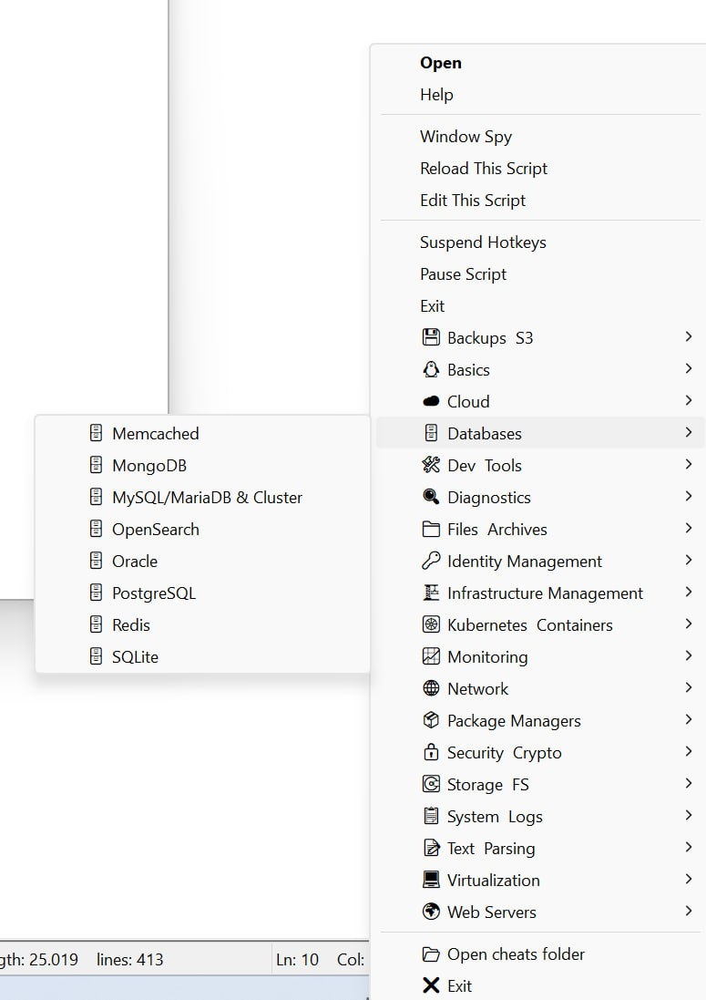

# 🪟 DevToolbox Cheats — Windows Setup

This directory contains everything needed to run **devtoolbox-cheats** on Windows using [AutoHotkey v1](https://www.autohotkey.com/download/1.x/).

Because Windows doesn't natively support Bash and Linux dialog tools cleanly in the tray, we use an AutoHotkey script (`cheats.ahk`) to create a native Windows system tray menu that opens the markdown cheatsheets in your default text editor. The script features **full autodiscovery and real-time search**, automatically building categories and menus from your `cheats.d` folder.

- **Global Search:** Press `Ctrl+Shift+S` anywhere to quickly find a cheatsheet by name.



---

## ⚠️ Requirements

- **AutoHotkey v1.1** — The script is written for AutoHotkey v1 syntax and **will not work with AutoHotkey v2**.
  The installer downloads it automatically. Manual download: [https://www.autohotkey.com/download/1.x/](https://www.autohotkey.com/download/1.x/)
- **Windows 10 or 11** (64-bit recommended)
- **PowerShell 5.x** (built into Windows — no separate install needed)
- **Internet access** (recommended; the installer auto-downloads AutoHotkey v1 — a bundled offline setup file is also included as a fallback)

---

## 🚀 Quick Automated Installation

The installer script:
- Verifies AutoHotkey **v1** is installed (installs it if the bundled setup file is present)
- Copies `cheats.d` cheatsheets to your user profile (`%USERPROFILE%\cheats.d`)
- Saves `cheats.ahk` with correct UTF-8 BOM encoding
- Deploys `cheats.ahk` to your Startup folder and launches it

> [!NOTE]
> The installer deploys `cheats.ahk` (not a compiled `.exe`) by default. Running the script
> directly through AutoHotkey avoids Windows Defender false-positive detections entirely.

### Fast Track: One-Liner Installation

Open a standard **PowerShell** window *(do **not** run as Administrator)* and paste:

```powershell
git clone https://github.com/dominatos/devtoolbox-cheats.git; cd devtoolbox-cheats\Windows-beta; powershell.exe -ExecutionPolicy Bypass -File .\install-devtoolbox.ps1
```

### Step-by-Step Installation

#### 1. Clone the Repository

```cmd
git clone https://github.com/dominatos/devtoolbox-cheats.git
```

#### 2. Run the Installer

1. Open a standard **PowerShell** window.
   *(Do **not** run as Administrator — the script will abort if it detects elevation.)*
2. Navigate to the `Windows-beta` directory:
   ```powershell
   cd "C:\path\to\devtoolbox-cheats\Windows-beta"
   ```
3. Run the installer:
   ```powershell
   powershell.exe -ExecutionPolicy Bypass -File .\install-devtoolbox.ps1
   ```

The script will:
- Check that **AutoHotkey v1** is installed
  - If not: **download** the latest v1 installer automatically from GitHub
  - Fallback: use the bundled `AutoHotkey_1.1.37.02_setup.exe` if the download fails
  - Abort with a clear message if only **AutoHotkey v2** is found
- Copy cheatsheets and deploy `cheats.ahk` to your Startup folder
- Launch the app immediately — look for the **Gear icon** in your system tray

> [!NOTE]
> The first run may take a minute to build the initial cache of categories and cheatsheets.

#### 3. (Optional) Compile to EXE

If you prefer a compiled `.exe`, pass the `-CompileExe` flag:

```powershell
powershell.exe -ExecutionPolicy Bypass -File .\install-devtoolbox.ps1 -CompileExe
```

> [!WARNING]
> Compiled AutoHotkey executables may be flagged by Windows Defender as
> `Trojan:Script/Wacatac.H!ml`. This is a **safe false positive** — see the section below.
> The default `.ahk` startup mode does not trigger this warning.

---

## 🔄 Updating DevToolbox

**Automatic Updates**: During installation, the script will ask if you want to set up an automatic daily updater. If you agree, Windows Task Scheduler will silently download and apply new cheatsheets every day at noon without any popups!
- The updater launcher (`update-launcher.vbs`) targets `%LOCALAPPDATA%\devtoolbox-cheats\update-cheats.ps1`.
- The installer automatically copies the updater scripts into `%LOCALAPPDATA%\devtoolbox-cheats\`.
- The updater script (`update-cheats.ps1`) reads and writes cheatsheets from `%USERPROFILE%\cheats.d`.
- Update logs are written to `%USERPROFILE%\cheats_updater.log` for troubleshooting.

If you skipped that step or prefer to update manually, you can just re-run the installer. The installer will safely overwrite the old files in your `~\cheats.d` folder without breaking your setup.

**Method 1: If you cloned with Git**
1. Open PowerShell and navigate to your cloned repository.
2. Pull the latest updates:

   ```powershell
   git pull
   ```

3. Run the installer again:

   ```powershell
   powershell.exe -ExecutionPolicy Bypass -File .\install-devtoolbox.ps1
   ```

**Method 2: If you don't have Git installed**
1. Download the latest source code `.zip` from the GitHub repository.
2. Extract the `.zip` and open the new `Windows-beta` folder in PowerShell.
3. Run the installer again (just like your first installation).

*(Note: If you created your own custom cheatsheets directly in `~\cheats.d`, they are safe! The installer only overwrites files that share the exact same name as the official ones).*

---

## 🛡️ Antivirus & False Positives (Wacatac)

Windows Defender may flag a compiled `cheats.exe` as `Trojan:Script/Wacatac.H!ml`.

- **This is a safe false positive.** AutoHotkey's compiler bundles a script with an interpreter; heuristic scanners sometimes flag this pattern.
- **Default behaviour:** The installer deploys `cheats.ahk` to your Startup folder and runs it through the AutoHotkey interpreter. This approach has avoided false positives in testing and is less likely to trigger Defender than the compiled `cheats.exe`.
- **If you used `-CompileExe`** and Defender removes the `.exe`: re-run the installer without that flag to switch back to the `.ahk` startup mode.

---

## 🛠 Manual Installation

If you prefer a manual setup or the automated script fails:

### 1. Install AutoHotkey v1

The automated installer handles this for you, but if doing it manually:
- Download from [https://www.autohotkey.com/download/1.x/](https://www.autohotkey.com/download/1.x/) and use Express Installation.
- Or run the bundled `AutoHotkey_1.1.37.02_setup.exe` included in this directory.

> [!IMPORTANT]
> **AutoHotkey v2 is not compatible.** The script uses v1 syntax. Make sure you install v1.1.x.

### 2. Copy the Cheatsheets

Copy the `cheats.d` folder from the root of this project to your Windows User directory:

```
C:\Users\YourUsername\cheats.d\
```

### 3. Run the Script

Double-click `cheats.ahk` — it will start immediately and place a **Gear icon** in your system tray.

> [!IMPORTANT]
> **Encoding (BOM):** If you see artifacts like `â€"` in your menu, the file was saved without
> a UTF-8 BOM. Fix it with:
> - **Notepad++:** Encoding → Convert to UTF-8 with BOM → Save.
> - **VS Code:** Click "UTF-8" in the status bar → "Save with Encoding" → "UTF-8 with BOM".

### 4. Add to Startup (Auto-Start on Boot)

1. Press `Win+R`, type `shell:startup`, press Enter.
2. Copy `cheats.ahk` into the Startup folder.
3. It will run automatically on every boot.

### ❓ Customizing the Tray Icon

Place a file named `icon.ico` inside your `%USERPROFILE%\cheats.d\` folder.
The script will detect and use it automatically on the next launch.

---

## ❓ Troubleshooting

### AutoHotkey v2 is installed instead of v1

The installer will detect this and exit with an error. Install v1 from:
[https://www.autohotkey.com/download/1.x/](https://www.autohotkey.com/download/1.x/)

Both v1 and v2 can coexist on the same system — just make sure the installer finds v1 first.

### Duplicate Gear icons in the system tray

This can happen if you previously used the old dual-file startup strategy (`cheats.exe` + `cheats.ahk`).

1. Right-click both icons → **Exit**.
2. Open your Startup folder (`Win+R` → `shell:startup`).
3. Delete `cheats.exe` if present; keep only `cheats.ahk`.
4. Double-click `cheats.ahk` to restart.

### The app doesn't start on boot

Verify `cheats.ahk` is present in your Startup folder (`shell:startup`) and that AutoHotkey v1 is installed.
